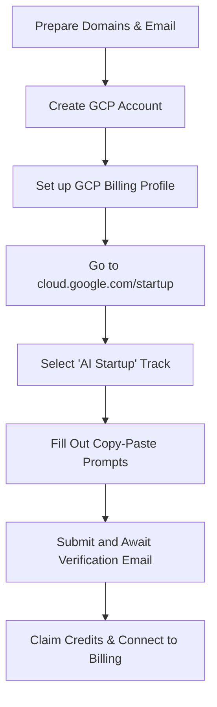

# 🚀 Google for Startups Cloud Program Playbook
## Securing Up to $350,000 in Cloud Credits for **Arbitrage Smart AI**

Welcome to your master application playbook! This guide is designed to help you secure up to **$350,000 in Google Cloud and Vertex AI credits** through the **Google for Startups Cloud Program**. Because you are building an AI-first platform combining autonomous agentic trade execution (**Arbitrage Smart AI**), you qualify for Google's highest-tier program support.

---

## 📋 Section 1: Pre-Application Checklist
Before you hit "Submit" on the official portal, you must ensure that all structural trust signals are in place. Google manually reviews these applications, and having these ready guarantees a higher approval rate.

- [ ] **Professional Website is Live:** 
  * Your landing page must be fully functional at [arbitragesmartai.com](https://arbitragesmartai.com).
- [ ] **Professional Business Email Active:**
  * You must submit the form using `arbitragesmartai@arbitragesmartai.com` or another address matching your domain. **Applications from `@gmail.com` addresses are almost always rejected.**
- [ ] **Google Cloud Platform (GCP) Account Created:**
  * If you don't have one, go to the [Google Cloud Console](https://console.cloud.google.com/) and register using your business email.
- [ ] **Active Billing Account Hooked Up:**
  * Open the Cloud Console, go to **Billing**, and create a billing account. Google requires a valid credit/debit card on file to verify identity and bind the credits. *(You will not be charged; the credits cover the costs once applied).*
- [ ] **LinkedIn Alignment (Optional but Highly Recommended):**
  * Update your LinkedIn profile to list yourself as the Founder / CEO of **Arbitrage Smart AI** and link it to your domain. This aids manual Google verification.

---

## 📝 Section 2: Copy-Paste Application Form Inputs

Use the exact copy-paste scripts below to fill out the crucial narrative boxes in the Google for Startups application form. These descriptions have been structured to emphasize high-value AI workloads, Gemini usage, and commercial viability.

### 🏢 Field 1: Startup Description (The Vision)
> **Form Label:** *Tell us about your startup, what problem you are solving, and your current traction.*

```text
Arbitrage Smart AI is building the future of autonomous agentic commerce. We have developed a proprietary multi-agent orchestration layer that bridges the gap between global market intelligence and logistics execution. 

Our ecosystem features 24/7 multi-agent autonomous market and intelligence data integration that feeds real-time spread analysis and order routing options into our proprietary Trade Orchestration Agents. We are solving a multi-billion dollar efficiency bottleneck in international commodity trade (e.g., Katke Enterprises) by automating complex document generation, compliance vetting, and optimal logistics routing via deep agentic workflows. Our target is to capture a significant percentage of operational efficiency gains in global trade logistics.
```

### ⚙️ Field 2: Technical Architecture & Google Cloud Usage
> **Form Label:** *How does your product utilize Google Cloud, Vertex AI, or other Google services?*

```text
Our infrastructure is built entirely on the Google Cloud ecosystem to guarantee scale, high availability, and secure agentic compliance. 

1. Vertex AI & Gemini Models: We utilize Vertex AI to access Gemini 1.5 Pro and Gemini Flash. These models power our market telemetry analysis (parsing and condensing real-time supply chain and exchange pricing data) and extract structured trade documents from PDFs.
2. Google Cloud Functions & Cloud Run: We deploy our lightweight autonomous python trade agents on Cloud Run and trigger transaction evaluations using serverless Cloud Functions.
3. Firebase: We use Firebase for low-latency, real-time data syncs between our frontend dashboard (Arbitrage Smart AI) and the backend multi-agent database.
4. Future Roadmap: As we scale, we intend to utilize Google BigQuery for historic market analysis and Looker for providing high-fidelity visual reports to B2B logistics partners.
```

---

## 🗺️ Section 3: Step-by-Step Application Guide

Follow these sequential steps to submit your application successfully:



### 1️⃣ Step 1: Open the Portal
Navigate to the official portal: **[cloud.google.com/startup](https://cloud.google.com/startup)** and click on **Apply Now**.

### 2️⃣ Step 2: Select the "AI Startup" Option
During the onboarding questions, choose **AI Startup**. This flag unlocks eligibility for up to **$350,000 in credits** instead of the standard tier caps, and fast-tracks your application directly to the Vertex AI partnership team.

### 3️⃣ Step 3: Enter Your Domain and Email
* **Email:** Use `arbitragesmartai@arbitragesmartai.com`
* **Domain:** `arbitragesmartai.com`
* Ensure your legal business name matches your billing card description.

### 4️⃣ Step 4: Fill Out Narratives
Paste the texts prepared in **Section 2** into the Startup Description and Technical Architecture fields.

### 5️⃣ Step 5: Connect Your Billing Account
The form will ask you to select or input your **Google Cloud Billing Account ID**. 
* To find this: Go to [console.cloud.google.com/billing](https://console.cloud.google.com/billing), select your active billing account, and copy the **Billing Account ID** (looks like `XXXXXX-XXXXXX-XXXXXX`).

---

## ⚡ Section 4: Critical Pro-Tips for Fast Approval

> [flat]
> **Use AI Studio Immediately for Prototyping:**
> Before the application is approved, you can start developing and testing models for free on the **Google AI Studio** dashboard. Do not let the processing time slow down your development.

> [flat]
> **Avoid the Agency / Consulting Flag:**
> When asked if you are an agency, development shop, or consulting firm, select **No**. Google only funds product-centric scalable startups. Always pitch Arbitrage Smart AI as a proprietary SaaS platform.

> [flat]
> **Do Not Cancel Your GCP Billing Card:**
> Keeping an active credit card attached to your Google Cloud Billing Account is mandatory even after the credits are active. Google will deduct usage from your $350,000 credit balance first, but if the credit card is deleted, your account will be suspended.

---

## 📈 What Happens Next?
1. **Verification Email (1–3 Days):** Google will send a confirmation email to `arbitragesmartai@arbitragesmartai.com` asking you to confirm ownership of the startup domain.
2. **Review Window (1–2 Weeks):** Google's startup team will manually assess your website, architecture, and eligibility.
3. **Grant Activation:** Upon approval, you will receive an onboarding email containing a link to apply the credits directly to your billing account. All Gemini and Vertex AI expenses will automatically deduct from this balance.

*Good luck with the pitch—your infrastructure is perfectly positioned to win!*
